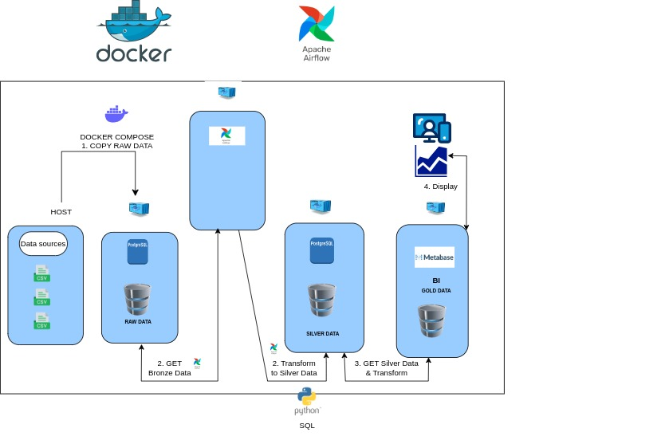
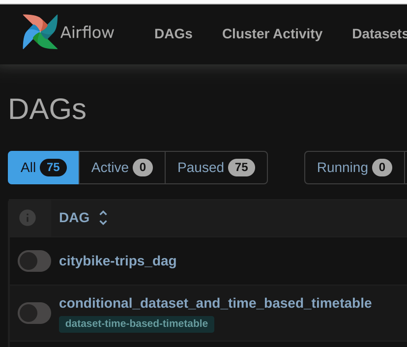
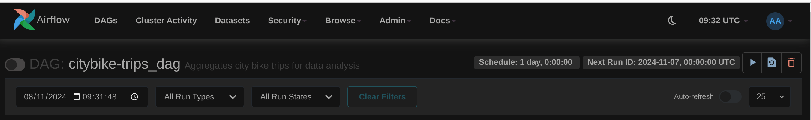
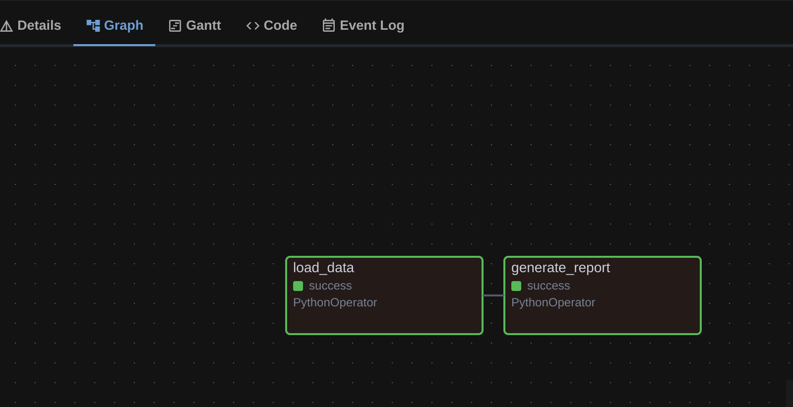
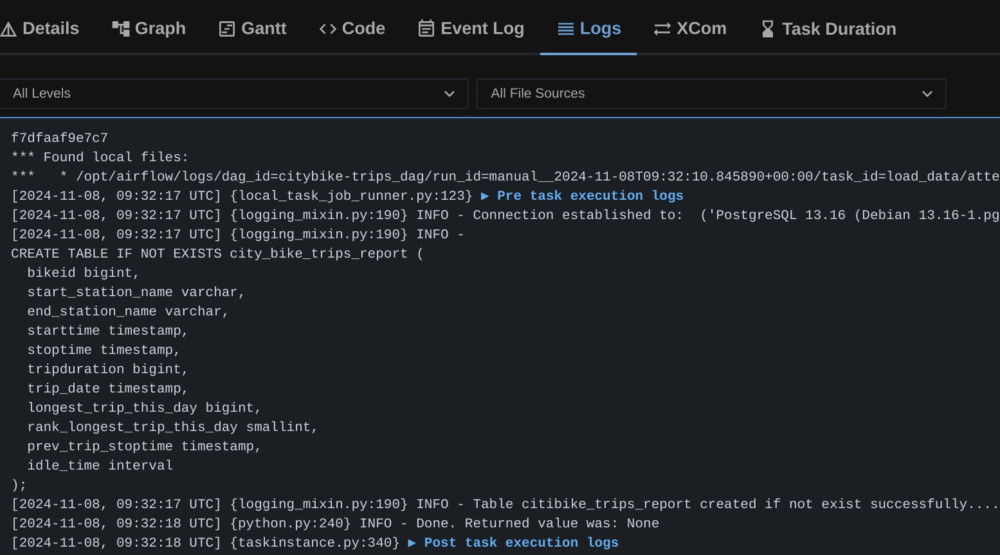
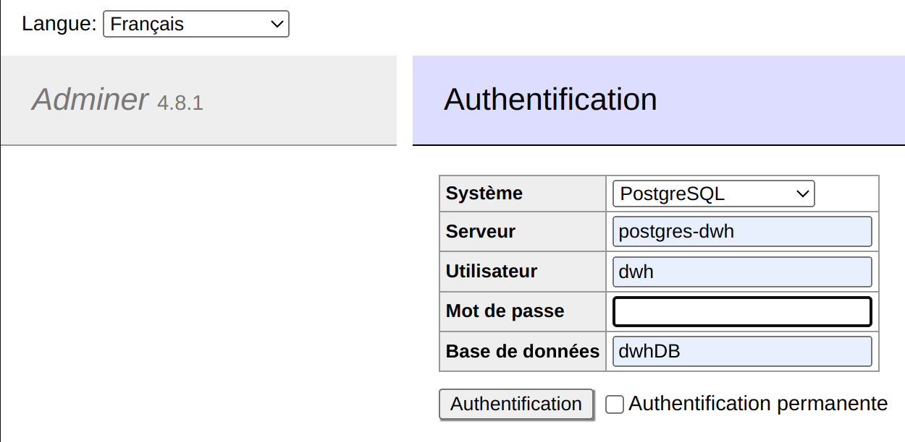
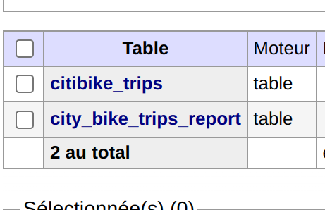
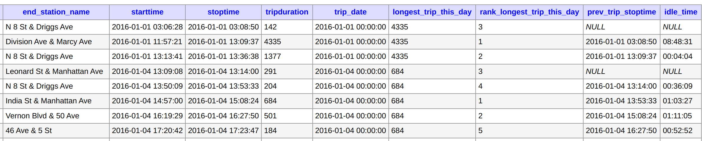
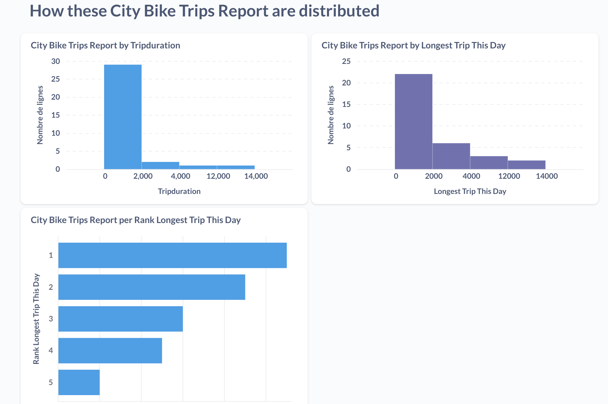

# Bike Trips Dashboard

The goal of this project is to:
- Use a dataset describing bike trips
- Create a new table with new insights to tell for example if a bike station is not used enough
- Create a dashboard of many metrics (time of use of a bike, idle time of a bike) 


## **Architecture**




## **Pre requisites**
- Docker and Docker compose installed
- Enough memory is adviced because Airflow needs at least 4 Gb of ram

## **Technical Stack**
- Docker / Docker compose
- Arflow
- Python
- Sql (Window functions)
- Metabase


## **Overview**

What's going on undercover when docker starts ?
1) Two databases are started (one for airflow, one for analytics)
2) csv files are imported into the second database automatically
3) An Airflow Server is started
4) An sql web client is started
5) Metabase client is started to display metrics of a database
6) Metrics are **automatically** created from existing columns of the database and table you picked up

## **INSTRUCTIONS**
### 1) Launch the containers:
https://airflow.apache.org/docs/apache-airflow/stable/howto/docker-compose/index.html

First you need to create a .env file to store the user_id (not root):
```
> touch .env | echo "AIRFLOW_UID=1000" > .env
```

Then launch the containers:
```
> docker compose up airflow-init
> docker compose up
```
Check all containers status:
```
> docker compose run airflow-worker airflow info

```
All containers should be up after **few minutes** depending on your network and your machine => (1) (2) (3) (4) (5) are ok.  

| component name            |        address         |            Comment              |
| :--------------- |:---------------:|:---------------:|
| Airflow Webserver         | http://localhost:8080  | login/passwd : airflow/airflow  |
| Adminer (sql web client)  | http://localhost:8081  |                                 |
| Metabase                  | http://localhost:3000  |                                 |


## 2) Then you can access the Airflow web interface of airflow to:

- Go to http://localhost:8080  (login/passwd : airflow/airflow)

 


## 3) Run the Dag    
- Click the run button on the right  
 
  
- Display the detail of the two step of this job   
   


- Select the first step and click on the logs tab   
    


## 4) Check from sql client the creation of the new table with additional metrics
  
  


### Raw data format (citibike_trips TABLE): this name comes from "citibike" and not citybike 

 | tripduration	| starttime	| stoptime | start_station_id | start_station_name | 	start_station_latitude	| start_station_longitude	| end_station_id	| end_station_name	| end_station_latitude	| end_station_longitude	| bikeid	| usertype	| birth_year | gender | 
 | :--------------- |:---------------|:--------------- |:--------------- |:--------------- |:--------------- |:--------------- |:--------------- |:--------------- |:--------------- |:--------------- |:--------------- |:--------------- |:--------------- |:--------------- |
 | 923	| 2016-01-01 00:00:41	| 2016-01-01 00:16:04	| 268	| Howard St & Centre St	| 40.71910537	| -73.99973337	| 3002	| South End Ave & Liberty St	| 40.711512	| -74.015756	| 22285	| Subscriber	| 1958	| 1 | 

### **DATABASE NEW METRICS from citibike_trips_report TABLE:**  
 


### 5) DASHBOARD NEW METRICS:  
- Go to metabase local address to see metrics and create a new one (5)
    - Go to http://localhost:3000/
    - You are going to set up your database connection, answering few questions
    - For step 4 "Ajoutez vos données"   
        - pick up PostgreSQL   
        - Then click on the "connecter la base de données" button   
Then you can see the metrics, and add more...

 

 => **We can create a graph from the idle_time column to see if a bike station is well located or not for example...**


## 6) Cleaning up:
```
> docker compose down --volumes --rmi all

```

## **LINKS**

https://airflow.apache.org/docs/apache-airflow/stable/howto/docker-compose/index.html   
https://www.metabase.com/

## **Remarks**
This project is absolutely not prod ready.
There would need to:
- some csv files are split into 10000 lines (because of github file size limitation) so they are not corresponding to real figures
- a mechanism to add more csv files could be added
- add a dedicated docker network instead of the default one
- add a memory resources section to containers
- some ports are hard coded => use .env
- Metabase runs with an in memory database which is for demonstration's sake only
- metabase Dashboard could be automatically created 
- add python content into requirements.txt file